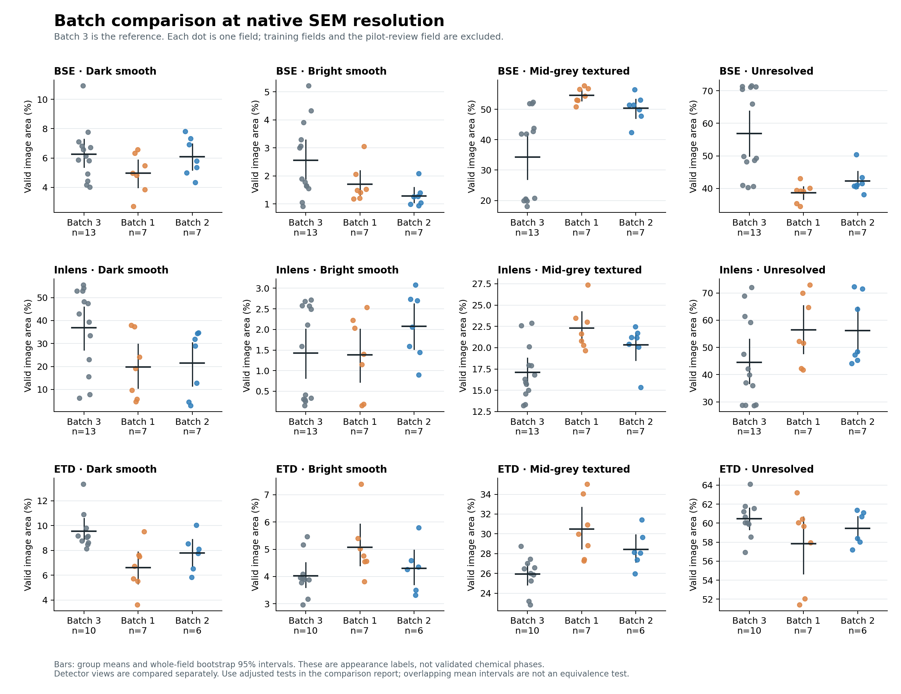

# SEM electrode batch comparison

## Full methods, results and reproducibility report

Polaron materials manufacturing challenge | 3 October 2026

For incorporation into the portal, read the [integration notes](#12-incorporating-this-evidence-into-the-portal-report) before combining these results with existing physical-phase or 3D transport claims.

**Question:** Do the supplied Batch 1 and Batch 2 images differ from the chosen reference, Batch 3, and which interpretable image measurements drive the difference?

> **Completed:** all 93 SEM images from 31 imaging fields were processed at their original resolution on Modal. All 93 saved image sets and four frozen detector models passed artifact integrity checks. This verifies the files and recorded measurements, not segmentation accuracy or material quality.

### What the completed run supports

| Comparison with Batch 3 | Exploratory BH findings | Stricter Holm findings |
| --- | --- | --- |
| Batch 1 | 7 of 33 testable measurements | 3 of 33 |
| Batch 2 | 2 of 33 testable measurements | 0 of 33 |

**Batch 1 has stronger evidence of changed appearance.** Its three Holm-significant findings concern Inlens bright-smooth and textured component concentration, and ETD textured area fraction. Batch 2 has two weaker Inlens component findings under BH, neither surviving Holm. These counts describe correlated measurements, not independent confirmations.

**Batch 2 is not established as equivalent to Batch 3.** There is no physically justified equivalence margin, performance label or approved manufacturing tolerance. Neither batch can receive a validated accept/reject decision from this run alone.

### The main limitation

The masks identify dark-smooth, bright-smooth and mid-grey textured appearances. Chemistry and preparation are unknown, so these cannot yet be certified as pore, active material and carbon-binder domain (CBD). Across the analysed BSE/Inlens/ETD groups, average unresolved area is approximately 39-60%, with individual fields near 73%. Changes in coverage can change fractions and fragment components.

Operational recommendation: review Batch 1 first because the evidence of appearance change is stronger. Keep Batch 2 under review; its weaker evidence does not establish manufacturing similarity or safety. This is a screening recommendation, not a calibrated release rule.

Companion artifacts: all-images/index.html (native mask gallery), batch-comparison.html (every statistical test), appearance_features.csv (all image measurements), comparison.json (machine-readable analysis) and validation.json (integrity checks). All reside under output/sem-native/all-images/.

## 1. Data, labels and the physical question

| Batch | Imaging fields | BSE | Inlens | ETD | SE | Total |
| --- | --- | --- | --- | --- | --- | --- |
| 1 | 7 | 7 | 7 | 7 | 0 | 21 |
| 2 | 7 | 7 | 7 | 6 | 1 | 21 |
| 3 - reference | 17 | 17 | 17 | 14 | 3 | 51 |
| Total | 31 | 31 | 31 | 27 | 4 | 93 |

A field ID identifies an imaged location, for example the same `img_<field>` prefix across detector files. Three detector images of that location are different measurements of the same field, not three independent specimens. The folder names identify batches; they do not supply defect labels or pixel-level phase annotations.

BSE denotes backscattered-electron imaging, while Inlens, ETD and SE identify other detector channels in the supplied names. Their contrast mechanisms and acquisition conditions are not interchangeable. Detector-specific calibration and models prevent a single intensity rule from silently treating all channels as the same physical signal. Exact microscope settings and sample preparation still need confirmation.

The latest user instruction makes **Batch 3 the reference**, superseding the earlier discussion of Batch 1 as a baseline. The purpose is comparison with this target, not supervised prediction of a known defective-batch label.

### Why appearances cannot yet be named chemical phases

Bright, smooth objects may be candidate active material; dark, smooth regions may be candidate voids or resin; and textured regions may be candidate CBD. Those are hypotheses. Detector physics, chemistry, resin filling, polishing damage, charging and local topography can change their appearance. In particular, a dark region in a surface-sensitive channel is not automatically a pore, and bright BSE contrast is not a universal active-material label.

The three labels are therefore deliberately named by what is observable. They are appearance classes, not three successive processing stages, three batches, or three discovered chemical compositions. The same caution applies to interpreting masks uploaded to ImageRep: coloured classes are input labels, not automatic proof of physical identity.

### Resolution and units

All processing retains each input image's native pixel grid. A 518 x 518 model tile is a crop of original pixels, not a resized overview. No training/inference stage reduces a 7000-pixel-wide image to 518 pixels. Display thumbnails and report figures can be scaled for viewing without changing the numerical analysis.

Micrometres per pixel and the electrode thickness direction have not been independently verified. Generic TIFF resolution information is not sufficient evidence of microscope calibration. Length densities and spatial slopes therefore remain in pixel units, and the image-y direction is not labelled through-thickness.

## 2. Frozen preprocessing and automatic seeds

Every image follows the same preprocessing algorithm. Parameters learned from reference data are fitted separately for each detector using selected Batch 3 training fields. Incoming images never fit the intensity thresholds or classifier. Per-image nuisance-correction coefficients are estimated by the fixed algorithm and exported, so “identical preprocessing” does not mean subtracting the same correction array from every image.

| Stage | Implemented operation and purpose |
| --- | --- |
| Validity mask | Exclude detected colour/border artifacts; retain invalid pixels separately from unresolved valid pixels. |
| Destriping | Bounded row correction with a 31-pixel window; correction capped at 4/255 intensity units. |
| Brightness correction | Fit a low-order brightness plane; correction capped at 8/255. Export the correction map because genuine structure may contribute to a fitted trend. |
| Denoising and texture | Gaussian denoising with sigma 0.7 pixels, followed by gradient magnitude with a 2-pixel pooling scale. |
| Fixed intensity scale | Pooled Batch 3 training quantiles 0.001 and 0.999 (0.1st and 99.9th percentiles) define the affine intensity rescaling. No incoming-image histogram matching. |
| Seed selection | Three intensity groups guide fixed intensity cuts; low-gradient quantile 0.4 and high-gradient quantile 0.75 define smooth/textured support. An intensity margin of 0.025 avoids ambiguous seeds. |
| Seed cleanup | Remove tiny seed islands below five pixels and exclude a two-pixel outer edge. |

### What the seed generator isolates

Label 1 is dark and smooth, label 2 bright and smooth, and label 3 middle-grey and textured. Selection uses the two-dimensional intensity-versus-gradient idea associated with Beran [1]. The present implementation uses automatic heuristic thresholds; it does **not** reproduce expert-selected histogram rectangles or establish the paper's material-specific phase assignments.

### Watershed growth

A gradient-based watershed expands supported seeds. Appearance compatibility, seed proximity and boundary handling prevent unrestricted filling of the entire image. Support below 0.35, regions too far from support (96 pixels), and uncertain boundaries remain unresolved. A one-pixel boundary exclusion further limits confident growth. The watershed produces candidate labels for classifier training and an independent diagnostic mask; it is not ground truth.

> No phase-complete human labels or expert scribbles were used in this run. Automatic seed agreement is a consistency diagnostic, not independently measured accuracy.

## 3. DINOv2 refinement and frozen deployment

The learned step follows the general sparse-label, pretrained-feature approach of Docherty [2]. DINOv2 supplies pretrained visual features. A lightweight, balanced logistic classifier learns the three provisional appearance labels from automatic training examples. The backbone is frozen; this run does not train a U-Net or DeepLabv3, fine-tune DINOv2, or train a supervised defective-batch classifier.

### Reference split

| Detectors | Batch 3 fields used for fitting | Fields available for final inference |
| --- | --- | --- |
| BSE / Inlens / ETD | 9luzk4jm, cfe5vt7s, ptg8lmto | BSE 13; Inlens 13; ETD 10 |
| SE | vc2whyaq, utfgcjfa | SE 1 - insufficient for comparisons |

Field 0grcilhi was used to review the native pilot and choose the post-classifier appearance-support gate. Its views are development data and are excluded from statistical inference across detectors. The original manifest split is retained for provenance, with the analysis applying an explicit additional exclusion. Incoming fields number seven for BSE/Inlens; ETD has seven in Batch 1 and six in Batch 2.

### Training and inference mechanics

Six distributed native crops per training field supply examples. Sampling is balanced and capped at 5,000 examples per appearance class per field. All four saved models use 384 normalised DINO features only (physics_channels=0); intensity and gradient enter seed generation and the separate consistency gate, not the classifier input vector. The optional scribble workflow can provide reviewed labels for a new model version, but no scribbles were supplied to this version.

Inference uses overlapping 518 x 518 native tiles, 98-pixel overlap, reflected edge context and cosine-weighted probability blending. Feature extraction uses stride 4 and 20 transformed views (five shifts with four flips). Large dense embeddings are discarded after tile processing; only three class scores and uncertainty diagnostics are retained at full image size.

### When the model abstains

A label is retained only when its score exceeds 0.65, normalised entropy is below 0.75, overlap disagreement is below 0.15, and its fixed measured appearance support is at least 0.35. A smooth mid-grey interior cannot be labelled textured solely because the classifier prefers class 3. Contradictory assignments become label 0, unresolved. The ungated mask is saved for audit.

The uncertainty display is the maximum of normalised entropy and one minus appearance support. This is a diagnostic map, not a calibrated probability of error or a statistical confidence interval. Field-level confidence intervals later in this report condition on this frozen segmentation.

Frozen state includes preprocessing and seed calibration, classifier weights, thresholds, DINO revision, source hashes and training-image identities. The backbone revision is 7764ea0f912e53c92e82eb78a2a1631e92725fc8. Batch 1 and Batch 2 do not alter that state.

## 4. Features: what is measured physically?

The comparison family contains 11 scalar measurements per detector. All are computed from the supported appearance masks and the valid-image mask. They describe a two-dimensional image, conditional on the segmentation. Physical phase-specific interpretations require validation of the labels first.

| Measurement | Definition | Interpretation and limit |
| --- | --- | --- |
| 3 appearance area fractions | A(k) = pixels labelled k / valid pixels | Observable coverage of each appearance. Unresolved pixels remain in the denominator. Not verified chemical volume fraction or porosity. |
| Unresolved fraction | U = unresolved valid pixels / valid pixels | Abstention/coverage diagnostic. It can reflect ambiguous structure, model mismatch, acquisition changes or missing classes. |
| Observed interfacial length density | L = unlike known-label shared pixel-edge length / valid image area | 2D visible boundary density in pixel^-1. Unknown gaps hide interfaces; this is a lower bound relative to completing the unknown mask, with grid orientation bias. Not 3D specific surface area. |
| 3 largest-component fractions | C(k) = largest connected component area / observed area of label k | Concentration of each label in one connected region; primary measurement uses 8-connectivity, with 4-connectivity saved as sensitivity. Not 3D percolation or transport. |
| 3 image-y slopes | Fit row-wise labelled-area fraction against pixel row position | Variation down the image, in fraction/pixel. Not a confirmed through-thickness gradient or evidence of binder migration without orientation and phase validation. |

### Measurements that are intentionally unavailable

**Departure from Bruggeman:** Delta tau = tau - epsilon^(-0.5) requires a consistently defined, verified tortuosity quantity and porosity. A 2D appearance mask supplies neither validated 3D transport tortuosity nor confirmed pore fraction. The field is null rather than invented. Path-length tortuosity and transport tortuosity factors also need a consistent convention before this expression can be used.

**Calibrated micrometre metrics:** if a verified pixel size s is later supplied, observed edge length scales by s and area by s squared, so length density scales by 1/s. That conversion alone does not validate the phase identities or remove missing-boundary bias.

**Particle size, CBD content and crack statistics:** these are sensible candidate physical KPIs only after defining and validating the required phase or object masks. The current three appearance masks do not justify relabelling every connected component as a particle or every dark line as a crack.

## 5. Statistical design and meaning of the verdict

**Sampling unit:** a whole imaging field within one detector. Pixels and overlapping tiles are not independent samples. Detector views of a field are analysed separately and never pooled to inflate the sample size. Means give each field equal weight; they are not pooled-pixel area estimates.

**Reference:** Batch 3 fields held out from fitting and the pilot-based gate decision. All training fields and field 0grcilhi are excluded. The comparison is within this supplied dataset; there is only one batch representing each condition, so it cannot establish variability across independently manufactured batches.

| Detector | Reference n | Batch 1 n | Batch 2 n | Test availability |
| --- | --- | --- | --- | --- |
| BSE | 13 | 7 | 7 | 22 tests |
| Inlens | 13 | 7 | 7 | 22 tests |
| ETD | 10 | 7 | 6 | 22 tests |
| SE | 1 | 0 | 1 | 22 unavailable slots |

**Effect estimate:** incoming field mean minus reference field mean. The report includes 95% percentile bootstrap intervals using 100,000 whole-field resamples. These are marginal intervals for individual effects, not simultaneous 95% coverage across all 88 comparisons. They quantify sampling variation under independent-field assumptions and do not propagate segmentation, chemistry or preprocessing uncertainty.

**Difference test:** a two-sided permutation test using the absolute mean difference. All allocations are enumerated: 77,520 for 7 versus 13 fields, 19,448 for 7 versus 10, and 8,008 for 6 versus 10. The null requires exchangeable labels; correlated fields or systematic acquisition confounding can invalidate the inference. A test using this mean statistic is not a complete test of every possible distributional change.

**Multiplicity:** the fixed family is 11 metrics x 2 incoming batches x 4 detectors = 88 slots. Of these, 66 are testable. Unavailable SE tests have no fabricated p-values; their slots conservatively remain in the adjustment denominator. Benjamini-Hochberg (BH) q-values are the exploratory primary correction. Holm-adjusted p-values are also supplied because metrics and detector views are correlated; Holm controls familywise error under arbitrary test dependence when individual tests are valid.

The exploratory evidence rule is complete image accounting, global BH q below 0.05, and a bootstrap difference interval excluding zero. The stricter sensitivity uses Holm below 0.05 with the same interval criterion. Neither method repairs invalid independence/exchangeability or systematic segmentation bias. Partial results were not used to stop the run.

> **Not significant is not equivalent.** No physical equivalence bounds or manufacturing tolerances were specified. A statistically detectable change also need not be operationally unacceptable. Accept/investigate/reject requires reviewed measurements, practical limits and validation on new batches.

## 6. Complete findings against Batch 3

The table below contains every finding meeting the exploratory BH criterion. Area-fraction changes and component-fraction changes are reported in percentage points (pp); a component fraction uses only observed same-label area as its denominator. All listed bootstrap intervals exclude zero.

| Detector / batch / measurement | Reference → incoming | Difference [95% CI], pp | BH q | Holm p |
| --- | --- | --- | --- | --- |
| BSE / Batch 1<br>Textured area | 34.31%<br>to 54.66% | +20.35<br>[12.66, 28.02] | 0.0357 | 0.2327 |
| BSE / Batch 1<br>Unresolved area | 56.88%<br>to 38.68% | -18.20<br>[-25.42, -11.00] | 0.0397 | 0.2926 |
| Inlens / Batch 1<br>Textured area | 17.10%<br>to 22.32% | +5.21<br>[2.82, 7.70] | 0.0313 | 0.1495 |
| Inlens / Batch 1<br>Bright-smooth component | 4.48%<br>to 9.59% | +5.11<br>[2.51, 8.00] | 0.0153 | **0.0284** |
| Inlens / Batch 1<br>Textured component | 12.03%<br>to 46.71% | +34.68<br>[15.85, 54.59] | 0.0153 | **0.0303** |
| Inlens / Batch 2<br>Bright-smooth component | 4.48%<br>to 7.61% | +3.13<br>[1.06, 5.74] | 0.0397 | 0.3251 |
| Inlens / Batch 2<br>Textured component | 12.03%<br>to 35.66% | +23.63<br>[8.65, 38.64] | 0.0329 | 0.1863 |
| ETD / Batch 1<br>Dark-smooth area | 9.55%<br>to 6.60% | -2.94<br>[-4.56, -1.41] | 0.0226 | 0.0874 |
| ETD / Batch 1<br>Textured area | 25.94%<br>to 30.49% | +4.56<br>[2.29, 6.98] | 0.0166 | **0.0486** |

**Batch 1:** the three bold Holm values support the strongest statistical evidence in this run. They concern two Inlens component concentrations and ETD textured area. Other BH findings are exploratory. No interfacial-density or image-y-slope test passes the global BH threshold.

**Batch 2:** its two Inlens component findings pass BH but not Holm. Its BSE and ETD comparisons are inconclusive after global correction. This is weaker evidence of change, not proof of equivalence or suitability.

The earlier seed/watershed-only BSE screen used different masks, 14 reference fields and 16 tests; neither batch passed its BH threshold. The provisional phrase “Batch 2 is closer” described selected average departures. The completed native DINO analysis supersedes that screen: Batch 2 still differs on two exploratory component measures, and no overall closeness test was performed.



## 7a. BSE: field-level distributions

Dots are whole fields, horizontal bars are group means, and vertical bars are pointwise 95% bootstrap intervals. Training and development-reviewed reference fields are excluded. Overlap of group-mean intervals is not itself a test of difference or equivalence. The accompanying plot uses 10,000 field resamples for group-mean intervals; the reported difference intervals use 100,000.

Batch 1 has more supported textured area than the held-out reference, but also much less unresolved area. Reference textured coverage averages 34.31%, compared with 54.66% in Batch 1; unresolved coverage moves from 56.88% to 38.68%. The extra assigned area is therefore partly coupled to whether the classifier can support a label. These two findings pass BH but not Holm.

The reference fields have a wide spread, including groups with distinctly different coverage. This should trigger review of acquisition conditions, sampled regions and mask behaviour. It does not justify assigning a new chemical phase to either group. Batch 2 has no BSE finding after global correction.

## 7b. Inlens: field-level distributions

Dots are whole fields, horizontal bars are group means, and vertical bars are pointwise 95% bootstrap intervals. Training and development-reviewed reference fields are excluded. Overlap of group-mean intervals is not itself a test of difference or equivalence. The accompanying plot uses 10,000 field resamples for group-mean intervals; the reported difference intervals use 100,000.

The strongest Inlens changes are component concentration, which is not plotted in these area panels. For Batch 1, the largest bright-smooth component occupies 9.59% of all observed bright-smooth area versus 4.48% in the reference. Its largest textured component occupies 46.71% versus 12.03%. Both survive Holm correction.

Batch 2 shows smaller increases on these two component averages (7.61% and 35.66% respectively), but only the exploratory BH criterion is met. Unknown pixels can split components, and these are two-dimensional observed masks, so the finding cannot be called improved or degraded electrical connectivity.

## 7c. ETD: field-level distributions

Dots are whole fields, horizontal bars are group means, and vertical bars are pointwise 95% bootstrap intervals. Training and development-reviewed reference fields are excluded. Overlap of group-mean intervals is not itself a test of difference or equivalence. The accompanying plot uses 10,000 field resamples for group-mean intervals; the reported difference intervals use 100,000.

The ETD textured fraction is 30.49% in Batch 1 versus 25.94% in the reference: +4.56 percentage points, 95% difference interval [2.29, 6.98], BH q=0.0166 and Holm p=0.0486. It is the area-fraction finding that survives the stricter correction.

Batch 1 has less dark-smooth area under BH, but that finding does not survive Holm. Batch 2 has no ETD result after global correction. Approximately 58-60% of ETD area remains unresolved on average, so these are supported appearances within an incomplete mask, not validated total phase fractions.

## 8. What uncertainty and quality checks revealed

| Detector | Reference unresolved | Batch 1 unresolved | Batch 2 unresolved |
| --- | --- | --- | --- |
| BSE | 56.88% | 38.68% | 42.28% |
| Inlens | 44.56% | 56.48% | 56.13% |
| ETD | 60.48% | 57.83% | 59.47% |

Unknown coverage is substantial and changes between groups. These pixels are not quietly redistributed among the three classes. The measured appearance gate also conflicts with many of the ungated DINO labels. This indicates disagreement between the ungated predictions and the specified intensity/gradient appearance rules, rather than only a thin uncertain boundary. The rules themselves are unvalidated, so this conflict rate is not an independently measured segmentation error rate.

Consequences: supported area can increase simply because fewer pixels abstain; unknown gaps can break connected regions; and only a small number of shared known-label boundaries may remain for interfacial-length estimation. The observed interface metric is therefore particularly censored. Its non-significant tests cannot establish equal true interfacial area.

### What passed

All 93 image sets preserve native dimensions and label IDs. Saved valid-pixel counts, DINO and watershed fractions, geometry label counts and seed counts match the masks. All four frozen model/calibration bundles are linked consistently. Probability arrays have valid native shapes and finite values within [0,1]. Across 930,000 sampled pixels, maximum score-sum rounding error was 0.000366, below the float16 tolerance of 0.002. PNG integrity checks passed. No validation errors were found.

### What was not validated

There are no independent expert phase masks, calibrated model probabilities, chemical identity confirmation, physical pixel-size verification, confirmed thickness orientation or labelled manufacturing outcomes. The integrity checks do not estimate Dice/IoU accuracy, porosity error, sensitivity to defective batches or false-rejection rate.

### Other limits to the conclusions

Nearby fields may be correlated; specimen-level grouping is unavailable. Fields differ in image extent, which can affect connected-component concentration and spatial slopes. The gradient definition depends on native pixel scale. Preprocessing can suppress genuine brightness variation even though corrections are bounded and recorded. All statistical uncertainty is conditional on this fixed pipeline. BH dependence assumptions are uncertain; the Holm sensitivity is stricter but cannot repair these measurement or sampling issues.

## 9. How to turn this into a trustworthy QC system

### 1. Establish physical labels and acquisition comparability

Confirm electrode chemistry, preparation, resin infiltration, detector settings, magnification and orientation with the materials expert. Review aligned detector views for representative fields, including high-unknown and apparently changed fields. Obtain sparse labels for physically defensible classes, with an explicit unknown/artifact category. Introduce another appearance class only if expert review supports it; do not force smooth mid-grey interiors into textured CBD.

### 2. Validate the segmentation before interpreting phase KPIs

Create independently reviewed whole-field masks or labelled regions for evaluation. Keep validation fields separate from scribble training and model/gate tuning. Measure class-specific agreement and boundary/coverage errors, inspect failure cases, and test sensitivity to modest threshold and preprocessing changes. A U-Net or DeepLabv3 trained on the same automatic labels would otherwise inherit their biases.

### 3. Define practical tolerances

Agree which verified physical KPIs affect manufacturing and specify acceptable changes in their own units. Obtain multiple independently manufactured acceptable batches and known problem batches where possible. Use those to estimate normal between-batch variation, assay repeatability, false-investigation rates and the cost of missed changes. A narrow p-value alone cannot define a rejection threshold.

### 4. Freeze before the unseen batch

Version preprocessing, detector-specific models, feature definitions, evaluation protocol and practical limits before the new batch arrives. Check detector and calibration compatibility first. Apply the frozen pipeline, aggregate at the correct specimen/field level, and compare to the saved reference. Do not refit intensity thresholds or the model to make the new batch resemble Batch 3.

### 5. Give the expert an actionable explanation

For each batch, show raw images, labelled overlays and unknown regions; KPI distributions with effect sizes; spatial examples driving the change; acquisition checks; and the reason for an abstention or investigation. A future accept decision should require supported equivalence within justified tolerances and adequate measurement quality. A reject decision should rely on validated out-of-spec evidence, not just an unfamiliar DINO embedding.

> Current decision support: prioritise review of Batch 1; investigate the two exploratory Batch 2 Inlens component findings; withhold validated accept/reject verdicts for both. High unresolved coverage itself is a reason for segmentation review.

## 10. Compute, reproducibility and deliverables

Modal ran native preprocessing, watershed and DINO inference on A100-80GB GPU workers. The Mac uploaded lossless native images and downloaded artifacts. The live inference worker cap was increased from four to 12 and then 24; observed concurrency reached ten workers. Autoscaler settings do not override workspace capacity limits. Preempted inputs were retried, including the last Batch 1 ETD image. The app completed successfully after all 93 outputs were saved.

Run: [Modal completed app ap-cupMNqGdQfvXpd9dcJTRnI](https://modal.com/apps/michael-99452/main/ap-cupMNqGdQfvXpd9dcJTRnI). Credentials are loaded locally from the permitted environment variables; .env contents are not report inputs or uploaded artifacts.

### Reproduce or continue

Run these commands from /Users/michaeldunn/bio-hack/HR-Dv2. The analysis dependencies are specified in install/requirements-sem-analysis.txt. A fresh GPU run needs a new output directory; --resume validates saved input identities, computational hashes, frozen models and completed image artifacts before skipping existing results.

```bash
.venv-modal/bin/python modal_all_sem.py --dry-run
```

```bash
.venv-modal/bin/python modal_all_sem.py --resume   --output-dir ../output/sem-native/all-images
```

```bash
.venv-modal/bin/python validate_sem_outputs.py   ../output/sem-native/all-images --require-complete
```

```bash
.venv-modal/bin/python sem_all_statistics.py   ../output/sem-native/all-images --bootstrap 100000
```

```bash
.venv-modal/bin/python plot_sem_comparison.py   ../output/sem-native/all-images
```

The line wraps above are for layout: enter each command on one shell line. A complete --resume run starts no GPU work. A new dataset or revised segmentation requires a new version, not overwriting the finished result. The report chart is created by plot_sem_comparison.py and this Markdown by build_sem_writeup.py.

| Artifact | Contents |
| --- | --- |
| index.html | Native image/mask gallery and scribble review. |
| appearance_features.csv | 93 rows: one per image/detector, with appearance fractions and geometry. Detector views remain paired at the field level. |
| batch-comparison.html / comparison.json | All effects, intervals, raw and adjusted tests, exclusions and limits. |
| `images/<batch-field-detector>/` | Raw and processed images, seeds, watershed, gated/ungated DINO masks, uncertainty, probabilities, corrections and metadata. |
| `models/<detector>/` | Calibration, portable classifier NPZ, training provenance and frozen run configuration. |
| run.json / input_manifest.json / manifest.json | Method settings, original inputs, source hashes and all completed records. |
| validation.json / operations.jsonl / analysis-provenance.json | Integrity results, live concurrency changes and analysis-code hashes. |

## 11. Source basis and relation to ImageRep

The implementation is an adaptation of published ideas to this unlabelled SEM dataset. Method inspiration does not transfer the original authors' chemical identifications, segmentation performance or validation to the current images.

### [1] Microstructure Reconstruction in Battery Electrodes Using Machine Learning Based on Low-Voltage Focused Ion Beam–Scanning Electron Microscopy Tomography Images

Lisa Beran, Vincent Nebel, Dominik Perius, Kshitij Kumar, Yannis Heim, Laura Bies, Tobias Kraus (2026). *Advanced Engineering Materials*. DOI: [10.1002/adem.70925](https://advanced.onlinelibrary.wiley.com/doi/10.1002/adem.70925).

Expert-selected regions in an intensity-versus-gradient histogram provide seeds; watershed propagation supports reference annotations used to train DeepLabv3. The demonstration uses PDMS-infiltrated NCA cathodes and low-voltage SE tomography.

- Automatic detector-specific intensity groups and gradient quantiles replace expert-selected histogram rectangles; these are provisional appearance labels.

- Our Gaussian denoising, bounded row-profile correction and robust capped plane correction are not the paper's BayesShrink, VSNR and brightest-pixel plane-fitting recipe.

- Our intensity scale is frozen from Batch 3 training fields and spatial pixels are preserved; intensity rescaling does not mean shrinking images.

- We use a frozen DINOv2 feature extractor and a linear classifier, not the paper's trained DeepLabv3 model or a reconstructed 3D volume.

### [2] Upsampling DINOv2 Features for Unsupervised Vision Tasks and Weakly Supervised Materials Segmentation

Ronan Docherty, Antonis Vamvakeros, Samuel J. Cooper (2026). *Advanced Intelligent Systems*. DOI: [10.1002/aisy.202501094](https://advanced.onlinelibrary.wiley.com/doi/10.1002/aisy.202501094).

Upsample frozen vision-transformer features through reduced patch stride and aligned transformation averaging, then map sparse user annotations to pixel classes with lightweight classifiers.

- Native 518-pixel overlapping tiles preserve original image sampling; tiles are blended into full-size outputs rather than shrinking each whole image to 518 pixels.

- Current training uses automatic appearance seeds; the report supports expert scribbles, but their absence must not be presented as expert-supervised training.

- In this completed run, all four balanced logistic classifiers use only 384 normalized DINO features (physics_channels=0). Intensity and gradient measurements generate the seeds and apply a separate appearance-consistency gate; they are not additional classifier inputs. The code supports optional local appearance channels, but that option was not used.

- Our balanced transform mode combines one-pixel axial shifts with flips; it is a reduced transform set relative to the paper's one- and two-pixel Moore-neighbourhood setup.

- Feature blurring, positional bias and uncertain transfer remain relevant; agreement with the seed generator does not validate chemical identity.

### [3] Prediction of Microstructural Representativity from a Single Image

Amir Dahari, Ronan Docherty, Steve Kench, Samuel J. Cooper (2025). *Advanced Science*. DOI: [10.1002/advs.202414149](https://advanced.onlinelibrary.wiley.com/doi/10.1002/advs.202414149).

Estimate sampling uncertainty in the fraction of one segmented phase from one 2D image or 3D volume, using two-point spatial correlation and an integral-range estimate; estimate the image size required for a target uncertainty.

**Current implementation:** The current native-resolution sem_* pipeline does not call ImageRep. Its batch comparisons instead use whole-field resampling and permutation testing. Do not label those intervals as ImageRep confidence intervals. ImageRep remains a possible separate representativity analysis after masks and its assumptions have been validated.

- The input is an existing phase segmentation; ImageRep does not discover physical phases or train a defect classifier.

- The uncertainty concerns representativity of the observed phase fraction, not segmentation correctness, imaging artifacts, or the probability of manufacturing failure.

- The paper assumes homogeneous material statistics and a finite distance beyond which phase correlations vanish.

- Each selected phase is analysed as a binary mask against all other phases; this loses joint phase dependence.

- The repository states that images smaller than 200 pixels in each dimension, large integral ranges or feature sizes over 70 pixels, and periodic structures are outside its stated validation or intended scope.

### Local implementation and evidence

Primary numerical evidence is the completed manifest, comparison.json and validation.json under output/sem-native/all-images. Source implementation is HR-Dv2/modal_sem.py, modal_all_sem.py, sem_physics.py, sem_dino.py, sem_support.py, sem_metrics.py, sem_batch_compare.py and sem_all_statistics.py. MODAL.md describes the operational commands. No medical-imaging model was validated on this electrode dataset.

ImageRep's one-image phase-fraction representativity uncertainty and this report's across-field batch comparison answer different questions. Neither replaces expert validation of the segmentation. The final analysis uses actual held-out fields rather than treating every pixel as an independent sample.

## Appendix: every BSE comparison

All differences are incoming minus reference. Values here use original metric units: fractions, fraction/pixel for y slopes, and pixel^-1 for interface density. The 95% interval is the whole-field bootstrap difference interval. BH and Holm adjustments cover all 88 planned slots.

| Measurement / incoming batch | Mean difference [95% CI] | Exact permutation p | BH q | Holm p |
| --- | --- | --- | --- | --- |
| Dark-smooth area fraction / B1 | -0.0129<br>[-0.0268, -0.000171] | 0.1196 | 0.2923 | 1.0000 |
| Dark-smooth area fraction / B2 | -0.0017<br>[-0.0152, 0.0109] | 0.8339 | 1.0000 | 1.0000 |
| Bright-smooth area fraction / B1 | -0.0086<br>[-0.0170, -0.000264] | 0.1342 | 0.3191 | 1.0000 |
| Bright-smooth area fraction / B2 | -0.0128<br>[-0.0205, -0.0055] | 0.0239 | 0.1167 | 1.0000 |
| Mid-grey textured area fraction / B1 | 0.2035<br>[0.1266, 0.2802] | 0.0028 | 0.0357 | 0.2327 |
| Mid-grey textured area fraction / B2 | 0.1605<br>[0.0792, 0.2409] | 0.0112 | 0.0695 | 0.8388 |
| Unresolved area fraction / B1 | -0.1820<br>[-0.2542, -0.1100] | 0.0036 | 0.0397 | 0.2926 |
| Unresolved area fraction / B2 | -0.1460<br>[-0.2205, -0.0710] | 0.0126 | 0.0695 | 0.9229 |
| Observed interface density / B1 | -7.04e-06<br>[-1.07e-05, -3.62e-06] | 0.0098 | 0.0665 | 0.7471 |
| Observed interface density / B2 | -7.35e-06<br>[-1.1e-05, -3.86e-06] | 0.0079 | 0.0636 | 0.6198 |
| Dark-smooth largest component / B1 | -0.0294<br>[-0.0630, -0.0032] | 0.1897 | 0.4327 | 1.0000 |
| Dark-smooth largest component / B2 | -0.0215<br>[-0.0554, 0.0050] | 0.3849 | 0.7527 | 1.0000 |
| Bright-smooth largest component / B1 | -0.0214<br>[-0.0440, 0.0022] | 0.1043 | 0.2793 | 1.0000 |
| Bright-smooth largest component / B2 | -0.0244<br>[-0.0423, -0.0073] | 0.0386 | 0.1505 | 1.0000 |
| Mid-grey textured largest component / B1 | 0.4225<br>[0.2396, 0.6092] | 0.0066 | 0.0583 | 0.5238 |
| Mid-grey textured largest component / B2 | 0.3780<br>[0.1915, 0.5692] | 0.0095 | 0.0665 | 0.7321 |
| Dark-smooth image-y fraction slope / B1 | -4.01e-06<br>[-1.4e-05, 6.54e-06] | 0.5697 | 0.9308 | 1.0000 |
| Dark-smooth image-y fraction slope / B2 | -2.42e-06<br>[-1.37e-05, 9.44e-06] | 0.7425 | 1.0000 | 1.0000 |
| Bright-smooth image-y fraction slope / B1 | 1.48e-06<br>[-4.79e-06, 7.54e-06] | 0.7143 | 1.0000 | 1.0000 |
| Bright-smooth image-y fraction slope / B2 | -1.45e-06<br>[-7.31e-06, 4.04e-06] | 0.7163 | 1.0000 | 1.0000 |
| Mid-grey textured image-y fraction slope / B1 | 5.32e-06<br>[-1.48e-05, 2.7e-05] | 0.6080 | 0.9728 | 1.0000 |
| Mid-grey textured image-y fraction slope / B2 | 1.63e-05<br>[-2.12e-07, 3.36e-05] | 0.0796 | 0.2347 | 1.0000 |

SE is omitted from these test tables because it has only one held-out reference field, no Batch 1 image and one Batch 2 image. Its 22 planned comparison slots are unavailable, not zero effects or p-values.

## Appendix: every Inlens comparison

All differences are incoming minus reference. Values here use original metric units: fractions, fraction/pixel for y slopes, and pixel^-1 for interface density. The 95% interval is the whole-field bootstrap difference interval. BH and Holm adjustments cover all 88 planned slots.

| Measurement / incoming batch | Mean difference [95% CI] | Exact permutation p | BH q | Holm p |
| --- | --- | --- | --- | --- |
| Dark-smooth area fraction / B1 | -0.1709<br>[-0.3016, -0.0333] | 0.0452 | 0.1592 | 1.0000 |
| Dark-smooth area fraction / B2 | -0.1546<br>[-0.2898, -0.0193] | 0.0668 | 0.2123 | 1.0000 |
| Bright-smooth area fraction / B1 | -0.000412<br>[-0.0092, 0.0083] | 0.9353 | 1.0000 | 1.0000 |
| Bright-smooth area fraction / B2 | 0.0065<br>[-0.0016, 0.0145] | 0.1917 | 0.4327 | 1.0000 |
| Mid-grey textured area fraction / B1 | 0.0521<br>[0.0282, 0.0770] | 0.0018 | 0.0313 | 0.1495 |
| Mid-grey textured area fraction / B2 | 0.0324<br>[0.0082, 0.0536] | 0.0300 | 0.1267 | 1.0000 |
| Unresolved area fraction / B1 | 0.1192<br>[-0.0018, 0.2382] | 0.1047 | 0.2793 | 1.0000 |
| Unresolved area fraction / B2 | 0.1157<br>[-0.0038, 0.2356] | 0.1140 | 0.2923 | 1.0000 |
| Observed interface density / B1 | 1.79e-05<br>[-5.11e-06, 4.21e-05] | 0.1003 | 0.2793 | 1.0000 |
| Observed interface density / B2 | 7.53e-06<br>[-9.14e-06, 2.37e-05] | 0.3506 | 0.7174 | 1.0000 |
| Dark-smooth largest component / B1 | 0.000839<br>[-0.0349, 0.0366] | 0.9688 | 1.0000 | 1.0000 |
| Dark-smooth largest component / B2 | -0.0256<br>[-0.0577, 0.0049] | 0.2272 | 0.4877 | 1.0000 |
| Bright-smooth largest component / B1 | 0.0511<br>[0.0251, 0.0800] | 0.000322 | 0.0153 | 0.0284 |
| Bright-smooth largest component / B2 | 0.0313<br>[0.0106, 0.0574] | 0.0041 | 0.0397 | 0.3251 |
| Mid-grey textured largest component / B1 | 0.3468<br>[0.1585, 0.5459] | 0.000348 | 0.0153 | 0.0303 |
| Mid-grey textured largest component / B2 | 0.2363<br>[0.0865, 0.3864] | 0.0022 | 0.0329 | 0.1863 |
| Dark-smooth image-y fraction slope / B1 | 6.21e-05<br>[4.43e-06, 0.00012] | 0.0800 | 0.2347 | 1.0000 |
| Dark-smooth image-y fraction slope / B2 | 2.46e-05<br>[-2.8e-05, 8.51e-05] | 0.4737 | 0.8336 | 1.0000 |
| Bright-smooth image-y fraction slope / B1 | 4.24e-07<br>[-1.7e-06, 2.78e-06] | 0.8008 | 1.0000 | 1.0000 |
| Bright-smooth image-y fraction slope / B2 | -6.65e-06<br>[-1.1e-05, -9.44e-07] | 0.0120 | 0.0695 | 0.8878 |
| Mid-grey textured image-y fraction slope / B1 | -1.7e-06<br>[-2.85e-05, 2.54e-05] | 0.9003 | 1.0000 | 1.0000 |
| Mid-grey textured image-y fraction slope / B2 | 2.59e-05<br>[1.04e-06, 4.81e-05] | 0.0541 | 0.1830 | 1.0000 |

SE is omitted from these test tables because it has only one held-out reference field, no Batch 1 image and one Batch 2 image. Its 22 planned comparison slots are unavailable, not zero effects or p-values.

## Appendix: every ETD comparison

All differences are incoming minus reference. Values here use original metric units: fractions, fraction/pixel for y slopes, and pixel^-1 for interface density. The 95% interval is the whole-field bootstrap difference interval. BH and Holm adjustments cover all 88 planned slots.

| Measurement / incoming batch | Mean difference [95% CI] | Exact permutation p | BH q | Holm p |
| --- | --- | --- | --- | --- |
| Dark-smooth area fraction / B1 | -0.0294<br>[-0.0456, -0.0141] | 0.0010 | 0.0226 | 0.0874 |
| Dark-smooth area fraction / B2 | -0.0174<br>[-0.0320, -0.0038] | 0.0393 | 0.1505 | 1.0000 |
| Bright-smooth area fraction / B1 | 0.0104<br>[0.0021, 0.0200] | 0.0302 | 0.1267 | 1.0000 |
| Bright-smooth area fraction / B2 | 0.0027<br>[-0.0049, 0.0107] | 0.5268 | 0.9091 | 1.0000 |
| Mid-grey textured area fraction / B1 | 0.0456<br>[0.0229, 0.0698] | 0.000566 | 0.0166 | 0.0486 |
| Mid-grey textured area fraction / B2 | 0.0249<br>[0.0079, 0.0429] | 0.0205 | 0.1060 | 1.0000 |
| Unresolved area fraction / B1 | -0.0265<br>[-0.0602, 0.0044] | 0.1173 | 0.2923 | 1.0000 |
| Unresolved area fraction / B2 | -0.0102<br>[-0.0275, 0.0072] | 0.3164 | 0.6630 | 1.0000 |
| Observed interface density / B1 | -1.16e-05<br>[-2.13e-05, -2.44e-06] | 0.0676 | 0.2123 | 1.0000 |
| Observed interface density / B2 | -1.33e-05<br>[-2.25e-05, -4.87e-06] | 0.0292 | 0.1267 | 1.0000 |
| Dark-smooth largest component / B1 | -0.0239<br>[-0.0527, 0.000741] | 0.2147 | 0.4724 | 1.0000 |
| Dark-smooth largest component / B2 | -0.0117<br>[-0.0429, 0.0165] | 0.5514 | 0.9308 | 1.0000 |
| Bright-smooth largest component / B1 | -0.0232<br>[-0.0425, -0.0052] | 0.0451 | 0.1592 | 1.0000 |
| Bright-smooth largest component / B2 | -0.0121<br>[-0.0356, 0.0095] | 0.3656 | 0.7313 | 1.0000 |
| Mid-grey textured largest component / B1 | -0.0528<br>[-0.1802, 0.0776] | 0.4734 | 0.8336 | 1.0000 |
| Mid-grey textured largest component / B2 | 0.0424<br>[-0.0408, 0.1471] | 0.6371 | 1.0000 | 1.0000 |
| Dark-smooth image-y fraction slope / B1 | -6.6e-07<br>[-1.49e-05, 1.4e-05] | 0.9398 | 1.0000 | 1.0000 |
| Dark-smooth image-y fraction slope / B2 | -9.41e-07<br>[-1.55e-05, 1.42e-05] | 0.9175 | 1.0000 | 1.0000 |
| Bright-smooth image-y fraction slope / B1 | 4.52e-06<br>[-8.95e-06, 1.83e-05] | 0.5712 | 0.9308 | 1.0000 |
| Bright-smooth image-y fraction slope / B2 | -6.01e-06<br>[-1.75e-05, 6.03e-06] | 0.4414 | 0.8093 | 1.0000 |
| Mid-grey textured image-y fraction slope / B1 | -7.23e-06<br>[-2.48e-05, 1.11e-05] | 0.4228 | 0.7917 | 1.0000 |
| Mid-grey textured image-y fraction slope / B2 | 7.75e-06<br>[-1.3e-05, 2.66e-05] | 0.4211 | 0.7917 | 1.0000 |

SE is omitted from these test tables because it has only one held-out reference field, no Batch 1 image and one Batch 2 image. Its 22 planned comparison slots are unavailable, not zero effects or p-values.

## 12. Incorporating this evidence into the portal report

This write-up describes the completed native SEM appearance-segmentation run only. It is a separate evidence source from the existing 17-feature and synthetic 3D transport sections in README.md and PROTOCOL.md. Those documents contain stronger physical labels and release verdicts than this run establishes.

| Existing portal statement or asset | How to handle it when incorporating this run |
| --- | --- |
| Graphite anode, silicon/metal inclusions, pores and CBD identified from contrast | Chemistry and preparation remain unknown for this analysis. Keep those physical assignments provisional unless supported by separate, cited experimental evidence. |
| Batch 1 defective; Batch 2 ACCEPT & PROMOTE | This run supports stronger appearance-change evidence for Batch 1 and weaker exploratory component changes for Batch 2. It establishes neither a defect label nor equivalence/safety. |
| 17 physical features / 5 reduced drivers | The completed native pipeline compares 11 appearance measurements per detector. Do not attach its p-values or confidence intervals to a different 17-feature vector or PCA model. |
| True directional tortuosity from a reconstructed 3D volume | portal/modal_taufactor_3d.py creates random grain-centre geometry and thresholds a distance metric to an input porosity, then solves diffusion on that synthetic volume. The solver outputs are conditional simulations, not measurements of an observed 3D electrode volume. Matching 2D descriptors does not uniquely recover real 3D connectivity. |
| Micrometre pore throats, binder migration and Bruggeman departure | These are not validated outputs of this run. Pixel calibration, phase identities, orientation and appropriate transport evidence are still required. |
| ImageRep uncertainty | The current code does not call ImageRep. Its 95% intervals use whole-field bootstrapping; do not present them as ImageRep results. |
| Published segmentation method reproduced exactly | Describe an adaptation: automatic seeds, bounded corrections, DINO-only classifier features and a separate appearance-support gate differ from the cited demonstrations. |

The existing portal application, README, PROTOCOL and transport outputs have not been rewritten by this documentation task. The table above flags claims that need reconciliation before combining the evidence in a single report.

### Assets copied into the portal for integration

These files can be served by the portal without accessing directories outside its project:

- [Field-distribution figure](public/reports/native-sem/batch-distributions.png) - web path `/reports/native-sem/batch-distributions.png`.

- [All 93 image measurements](public/reports/native-sem/appearance_features.csv) - web path `/reports/native-sem/appearance_features.csv`.

- [All statistical results](public/reports/native-sem/comparison.json) - web path `/reports/native-sem/comparison.json`.

- [Completed integrity checks](public/reports/native-sem/validation.json) - web path `/reports/native-sem/validation.json`.

Source artifacts remain in [the completed native run](../output/sem-native/all-images/). The [native mask gallery](../output/sem-native/all-images/index.html) and [statistical HTML report](../output/sem-native/all-images/batch-comparison.html) are local companion artifacts; their full image payloads have not been copied into the portal.

### Suggested wording for the report abstract

We processed 93 native-resolution SEM images from 31 fields using detector-specific frozen preprocessing, intensity-gradient seeds, conservative watershed and a pretrained DINOv2 feature classifier. The resulting three appearance classes were kept physically provisional, with explicit abstention on unsupported pixels. Against held-out Batch 3 fields, Batch 1 showed seven exploratory BH-adjusted differences, including three that survived Holm correction; Batch 2 showed two exploratory Inlens component differences, neither surviving Holm. Large unresolved fractions and unverified phase identities limit interpretation. These results support prioritised expert review, not validated defect detection, equivalence or batch release.

## 13. How this run differs from the other analyses

The completed run performs image segmentation, measurement and statistical comparison. Other parts of the project address visual exploration, physical interpretation, sampling representativity, feature selection or transport simulation. They answer different questions and should not be treated as interchangeable evidence.

| Part of the project | Question it addresses | Relationship to the completed run |
| --- | --- | --- |
| Earlier DINO PCA / clustering | Which image regions have similar pretrained feature vectors? | Exploratory colours and unsupervised clusters. The old overview run downsampled images and its clusters followed large spatial patterns. The new run preserves native pixels and trains a small detector-specific classifier from intensity/gradient appearance seeds, then leaves unsupported pixels unresolved. |
| Existing 17-feature physical dictionary | How much pore/active material exists, and what are its dimensions, shapes and distribution? | Potentially useful measurement definitions, but their physical meaning depends on validated masks, scale and orientation. Our 11 measurements per detector describe provisional appearance masks. They are not interchangeable with the existing porosity, graphite-loading or micrometre throat numbers. |
| ImageRep | How representative is one segmented image for estimating a phase fraction? | Post-segmentation spatial sampling analysis. It does not produce chemical phase labels. The completed run instead uses variation between whole held-out fields for bootstrap intervals and permutation tests. |
| Five-feature reduction panel | Which measurements should be retained as a compact fingerprint? | Feature selection or dimensionality reduction comes after measurement. FeatureReductionGuide.tsx currently displays a fixed five-feature selection and fixed values; this inspection did not establish a fitted PCA transform or empirical orthogonality. The new run compares all 11 specified measurements with multiple-testing adjustment. |
| Synthetic 3D geometry + TauFactor | How would diffusion behave in an assumed 3D pore network? | The code generates random grain geometry using supplied porosity/anisotropy, then solves transport. These are conditional simulation outputs, not recovered 3D ground truth from the supplied 2D SEM images. Our run makes no tortuosity estimate. |
| Portal accept / promote / reject logic | Is a material usable for manufacturing? | A decision layer requiring validated physical measurements and practical tolerances. Our analysis reports evidence of appearance differences and abstains from validated release decisions. |

For example, the portal reference porosity of 11.16% and the dark-smooth area fraction from this run measure differently defined masks. The latter deliberately leaves many pixels unresolved and does not certify dark regions as pores. Likewise, a TauFactor value from a generated volume is a transport property of that generated geometry, not an independently observed property of Batch 1.

The new method is not automatically more accurate simply because it uses DINOv2 or more GPU time. Its useful additions are native-resolution coverage, reproducible detector-specific models, explicit unknowns, audit-ready artifacts and field-level statistical comparisons. The high unresolved fraction demonstrates that expert segmentation review is still needed before it can replace or validate the physically named feature extractor.

A defensible combined workflow is: validate physical labels and acquisition calibration; measure relevant 2D KPIs; assess image representativity where ImageRep assumptions hold; compare batches at the correct sampling level; and present any synthetic 3D transport results as a separate sensitivity study. A release rule comes only after tolerances and predictive performance have been validated.
