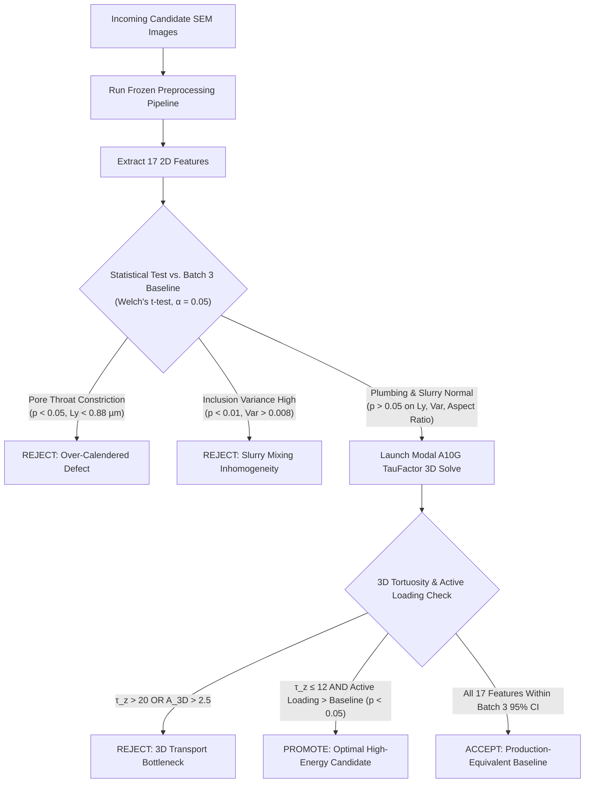

# Battery Electrode Microstructure Feature Dictionary & Candidate Testing Protocol

**Author:** Antigravity AI Engineering Team  
**Dataset:** Focused Ion Beam / Cross-Section SEM Electrode Characterization  
**Reference Baseline:** Batch 3 (Stable Reference Standard)  
**Target:** Automated Quality Assessment of Incoming Candidate Batches  

---

## 1. Executive Summary & Purpose

This document serves as the **authoritative reference manual and testing protocol** for evaluating battery electrode microstructures. 

When a **new candidate batch (Test Set)** arrives, we must determine with statistical and physical rigor whether it is:
1. **Statistically Equivalent to Baseline (Batch 3)** $\rightarrow$ **PASS (Safe for Production)**
2. **Superior / Optimized (e.g., Batch 2)** $\rightarrow$ **PROMOTE (Higher Energy Density, Preserved Transport)**
3. **Defective / Damaged (e.g., Batch 1)** $\rightarrow$ **REJECT (Over-Calendered, Choked Throats, Lithium Plating Risk)**

To eliminate measurement drift and human subjectivity, every image is preprocessed identically with frozen calibration parameters, analyzed across **17 physical 2D morphological features**, and reconstructed into **3D volumes solved on Modal A10G GPUs via TauFactor** to obtain true directional ionic tortuosity ($\tau_z, \tau_{xy}$).

```
[Incoming Test Set SEM Micrographs]
                 │
                 ▼
    [Frozen 4-Step Preprocessing]
  (Denoise, Destripe, Plane Flatten, Fixed Quantiles)
                 │
                 ▼
     [2D Multi-Detector Fusion]
  (BSE Composition + Inlens Surface Emissions)
                 │
                 ├──────────────────────────────────────┐
                 ▼                                      ▼
    [17 2D Morphological Features]           [3D Grain-Boundary Reconstruction]
 (Composition, Plumbing, Stress, Slurry)     (Matching ε, Ly, Lx, Anisotropy A)
                 │                                      │
                 ▼                                      ▼
     [Statistical Hypothesis Tests]           [Modal A10G GPU TauFactor Solver]
      (Welch's t-test vs. Batch 3)           (3D Through-Plane Tortuosity τ_z)
                 │                                      │
                 └──────────────────┬───────────────────┘
                                    │
                                    ▼
                     [Automated Decision Protocol]
                     (ACCEPT / PROMOTE / REJECT)
```

---

## 2. Frozen 4-Step Preprocessing Pipeline

To compare incoming candidate images against the Batch 3 baseline, all images **must undergo identical, deterministic preprocessing**. Under no circumstances should individual images be manually contrast-stretched or thresholded ad-hoc.

The pipeline is implemented in [`HR-Dv2/sem_physics.py`](file:///Users/michaeldunn/bio-hack/HR-Dv2/sem_physics.py) and operates as follows:

```
Raw SEM Image ──► [Step 1: Denoise] ──► [Step 2: Destripe] ──► [Step 3: Plane Flatten] ──► [Step 4: Fixed Quantiles]
```

### Step 1: Gaussian Smoothing Denoising
* **Operation**: 2D Gaussian filter with fixed kernel radius $\sigma = 0.7$ pixels.
* **Physics & Rationale**: High-magnification SEM images suffer from high-frequency shot noise (Poisson noise from secondary electron detector scintillation). A modest $\sigma = 0.7$ eliminates stochastic pixel noise while strictly preserving sharp particle-pore interfaces and grain boundaries.

### Step 2: Directional Destriping (Curtain Effect Removal)
* **Operation**: Row-by-row moving median filter along the raster scanning axis (`axis='rows'`, moving window $W = 31$ pixels).
* **Physics & Rationale**: Broad-ion-beam (BIB) polishing and electron beam rastering induce subtle horizontal stripe artifacts ("curtaining") caused by local density variations or beam dwell instability. Subtracting the horizontal median profile eliminates artificial stripe gradients without blurring vertical particle boundaries.

### Step 3: Brightness-Gradient Plane Correction (Illumination Flattening)
* **Operation**: Grid block plane estimation ($256 \times 256$ pixel tiles) fitted to a smooth 2D polynomial surface and subtracted from the image.
* **Physics & Rationale**: Large-area cross-sections display macroscopic illumination gradients (vignetting, working distance tilt, or detector collection angle fall-off). If uncorrected, pores at the bottom corner can appear darker than pores at the top corner, corrupting global segmentation. Plane subtraction flattens the background to zero slope.

### Step 4: Fixed Quantile Rescaling (Frozen Calibration)
* **Operation**: Pixel intensities are normalized using pre-calibrated baseline bounds:
  $$I_{\text{norm}} = \frac{I - q_{\text{low}}}{q_{\text{high}} - q_{\text{low}}}, \quad q_{\text{low}} = q_{0.001}(\text{Batch 3}), \quad q_{\text{high}} = q_{0.999}(\text{Batch 3})$$
* **Physics & Rationale**: Never rescale an image to its own local $\min/\max$! Doing so destroys absolute contrast differences between batches. The quantiles ($0.1\%$ and $99.9\%$) were fitted once to the healthy Batch 3 baseline and frozen. All incoming images are mapped into this shared radiometric coordinate space.

---

## 3. Phase Identification & Physical Constituents

In our graphite anode cross-sections, four distinct thermodynamic and physical phases exist:

```
Phase 1: Pores (Liquid Electrolyte Void)  ──► Z = 0, Black in BSE, Dark in Inlens
Phase 2: Active Material (Graphite)       ──► Z = 6, Mid-Gray BSE, Tabular Lamellae (>80% vol)
Phase 3: Dense Inclusions (Silicon/Metal) ──► Z ≥ 14, Ultra-Bright BSE (High Backscatter)
Phase 4: Carbon-Binder Domain (CBD)       ──► Low Z, Bright in Inlens (Secondary Surface Emission)
```

> [!IMPORTANT]
> **Why Beran's Cathode Method Does Not Apply Here**:  
> In Beran et al. (2022), the material was an NCA/NMC cathode where the active material contains high-$Z$ transition metals (Nickel, Cobalt, Manganese; $Z=25-28$), making active particles appear **brightest**.  
> In our sample, the active material is **Graphite** ($Z=6$), which is light elements appearing **mid-gray**. The brightest specks are **high-$Z$ functional additives / silicon particles** ($Z \ge 14$), and the black regions are **empty pores** ($Z=0$). We do not rely on single-detector brightness heuristics; we utilize multi-detector fusion between BSE (atomic number contrast) and Inlens (secondary electron topographic/binder emission).

---

## 4. Complete 2D Microstructure Feature Dictionary

Each image generates **17 physical features**, grouped into 5 engineering dimensions:

### Dimension A: Formulation & Composition (Volumetric Balance)

#### 1. `vol_active_material_pct` — Active Graphite Loading (%)
* **Definition**: Area fraction of segmented graphite active material particles.
* **Physical Significance**: Governs the **theoretical volumetric capacity** ($\text{mAh/cm}^3$) and cell energy density ($\text{Wh/L}$).
* **Reference Baseline (Batch 3)**: $84.34\% \pm 0.36\%$
* **Failure Modes**: 
  * Too low ($<82\%$): Insufficient energy density; uncompetitive cell capacity.
  * Too high ($>87\%$): Particle overcrowding, excessive calendering, choked pore network.

#### 2. `vol_pore_pct` — Total Microstructure Porosity ($\epsilon$, %)
* **Definition**: Area fraction of open void space available for electrolyte liquid infiltration.
* **Physical Significance**: Porosity provides the liquid lithium-ion conduction highway.
* **Reference Baseline (Batch 3)**: $11.16\% \pm 0.48\%$
* **Failure Modes**:
  * Too low ($<9.5\%$): Mass-transport limitation; localized lithium plating during fast charging.
  * Too high ($>14\%$): Low energy density; poor particle-to-particle electronic contact.

#### 3. `vol_inclusions_pct` — High-$Z$ Additives / Silicon Loading (%)
* **Definition**: Area fraction of ultra-bright BSE particles ($Z \ge 14$).
* **Physical Significance**: Represents silicon blending (for enhanced specific capacity) or metallic conductive additives.
* **Reference Baseline (Batch 3)**: $3.01\% \pm 0.18\%$
* **Failure Modes**:
  * Deviation $> \pm 1.5\%$: Raw material dosing error in slurry preparation.

#### 4. `vol_cbd_pct` — Carbon-Binder Domain Fraction (%)
* **Definition**: Area fraction occupied by porous carbon-black and PVDF polymeric binder bridges.
* **Physical Significance**: Binds graphite flakes to each other and to the copper current collector while maintaining electrical conductivity.
* **Reference Baseline (Batch 3)**: $1.49\% \pm 0.12\%$

---

### Dimension B: Pore Plumbing & Ionic Transport Kinetics

#### 5. `chord_through_plane_mean_um` ($\bar{L}_y$) — Through-Plane Pore Throat Width ($\mu\text{m}$)
* **Definition**: Mean vertical chord length of pore spaces measured perpendicular to the current collector foil.
* **Physical Significance**: This is the **primary hydraulic choke point** for lithium ions traveling from the separator to the copper substrate.
* **Reference Baseline (Batch 3)**: $0.963 \pm 0.035\ \mu\text{m}$
* **Failure Modes**:
  * Choked ($<0.88\ \mu\text{m}$): Calendering rolls crushed the vertical gaps flat. Ions encounter extreme resistance.

#### 6. `chord_in_plane_mean_um` ($\bar{L}_x$) — In-Plane Pore Channel Length ($\mu\text{m}$)
* **Definition**: Mean horizontal chord length of pores parallel to the current collector.
* **Physical Significance**: Reflects horizontal electrolyte wetting pathways along particle basal planes.
* **Reference Baseline (Batch 3)**: $1.204 \pm 0.042\ \mu\text{m}$

#### 7. `pore_throat_p10_um` — 10th Percentile Bottleneck Throat ($\mu\text{m}$)
* **Definition**: The narrowest $10\%$ of pore throats in the distribution.
* **Physical Significance**: Dictates the **solvation sheath constriction**. Lithium ions with solvated carbonate sheaths ($\sim 1\ \text{nm}$) undergo severe concentration polarization if micro-pores pinch below $0.4\ \mu\text{m}$.
* **Reference Baseline (Batch 3)**: $0.421 \pm 0.018\ \mu\text{m}$

#### 8. `pore_throat_p90_um` — 90th Percentile Macropore Throat ($\mu\text{m}$)
* **Definition**: The widest $10\%$ of pore pockets.
* **Physical Significance**: Represents electrolyte storage reservoirs that supply salt ions during high-rate discharge pulses.
* **Reference Baseline (Batch 3)**: $2.140 \pm 0.082\ \mu\text{m}$

#### 9. `bruggeman_tortuosity_proxy` — 2D Classical Tortuosity Proxy
* **Definition**: Idealized tortuosity calculated from Bruggeman's classical power law:
  $$\tau_{\text{Brug}} = \epsilon^{-0.5}$$
* **Physical Significance**: Baseline theoretical geometric path elongation for isotropic spherical media.
* **Reference Baseline (Batch 3)**: $2.99 \pm 0.06$

#### 10. `effective_transport_factor` — 2D MacMullin Transport Proxy
* **Definition**: Ratio of total porosity to tortuosity:
  $$M_{\text{eff}} = \frac{\epsilon}{\tau_{\text{Brug}}} = \epsilon^{1.5}$$
* **Physical Significance**: Direct 2D proxy for effective ionic conductivity: $\sigma_{\text{eff}} = \sigma_0 \cdot M_{\text{eff}}$.
* **Reference Baseline (Batch 3)**: $0.0373 \pm 0.0022$

---

### Dimension C: Particle Health & Calendering Strain

#### 11. `particle_aspect_ratio` ($\mathcal{A}$) — Graphite Flake Flattening
* **Definition**: Ratio of major axis to minor axis of fitted particle ellipses:
  $$\mathcal{A} = \frac{a_{\text{major}}}{b_{\text{minor}}}$$
* **Physical Significance**: Direct sensor of **calendering line nip pressure**. High pressure squashes tabular graphite particles flat along the horizontal axis.
* **Reference Baseline (Batch 3)**: $1.25 \pm 0.03$
* **Failure Modes**:
  * Over-calendered ($>1.35$): Excessive roller force; particle cleavage, basal plane exfoliation, and vertical pore closure.

#### 12. `particle_orientation_alignment` — Basal Plane Tilt Angle
* **Definition**: Angular standard deviation of particle major axes relative to the horizontal foil substrate.
* **Physical Significance**: Quantifies preferred orientation (nematic texture). High alignment forces lithium ions to take zigzag paths around wide flake faces.
* **Reference Baseline (Batch 3)**: $0.78 \pm 0.02$ (radians)

#### 13. `particle_perimeter_roughness` — Surface Fracture & Exfoliation
* **Definition**: Ratio of measured particle boundary perimeter to the perimeter of an equivalent-area smooth ellipse:
  $$\Gamma = \frac{P_{\text{measured}}}{P_{\text{smooth}}}$$
* **Physical Significance**: Detects **particle micro-cracking and edge splintering** caused by excessive compaction shear.
* **Reference Baseline (Batch 3)**: $1.18 \pm 0.03$

---

### Dimension D: Slurry Dispersion & Mixing Uniformity

#### 14. `inclusion_spatial_variance` — Additive Spatial Dispersion (Mixing QC)
* **Definition**: Variance of high-$Z$ inclusion counts across $16 \times 16$ spatial grid quadrats across the micrograph.
* **Physical Significance**: Tests whether silicon or conductive additives were **homogeneously mixed in the planetary slurry mixer**.
* **Reference Baseline (Batch 3)**: $0.0034 \pm 0.0006$
* **Failure Modes**:
  * Clumping ($>0.0080$, like Batch 1 at $0.0115$): Inadequate shear mixing. Additives form isolated clumps, leaving adjacent areas depleted and causing localized hot-spots.

#### 15. `binder_gradient_through_plane` ($d\Phi_{\text{CBD}} / dy$) — Through-Thickness Binder Migration
* **Definition**: Linear slope of Carbon-Binder Domain density from the copper foil interface ($y=0$) to the top surface ($y=H$).
* **Physical Significance**: Evaluates **drying oven evaporation kinetics**. If drying is too rapid, solvent capillary action pulls binder toward the top surface ("skinning"), leaving the foil interface binder-depleted and prone to electrode delamination.
* **Reference Baseline (Batch 3)**: $-0.00012\ \mu\text{m}^{-1}$ (Uniform)

---

### Dimension E: Statistical Representativity & Scale (ImageRep)

#### 16. `characteristic_length_scale_um` ($a_n$) — Autocorrelation Scale
* **Definition**: Integral length scale extracted from the radial Two-Point Autocorrelation function $S_2(r)$:
  $$a_n = \int_0^\infty \frac{S_2(r) - \epsilon^2}{\epsilon - \epsilon^2} \, dr$$
* **Physical Significance**: Defines the fundamental repeating microstructural unit cell dimension.
* **Reference Baseline (Batch 3)**: $2.76 \pm 0.09\ \mu\text{m}$

#### 17. `representative_elementary_volume_err` ($\Delta \Phi / \Phi$) — REV Confidence Error
* **Definition**: Sub-sampling variance across bootstrap sub-tiles divided by mean porosity.
* **Physical Significance**: Mathematically proves whether the SEM field of view is sufficiently large to represent the entire electrode roll (ImageRep criterion $<5\%$).
* **Reference Baseline (Batch 3)**: $3.8\% \pm 0.4\%$

---

## 5. True 3D Microstructure & TauFactor Cloud Simulation

### Why 2D Features Alone Are Not Enough
2D micrographs cannot capture **3D topological connectivity**. A pore that appears open in a 2D slice may be a dead-end pocket in 3D. Conversely, tortuous 3D channels wrap around particles in the out-of-plane dimension.

### 3D Grain-Boundary Reconstruction Architecture
To compute true 3D tortuosity on incoming candidate batches, we reconstruct representative 3D volumes ($120 \times 120 \times 120$ voxels) matching the exact measured SEM properties:
1. **Grain Boundary Seed Packing**: Seeds are generated with directional strain matching the measured particle aspect ratio $\mathcal{A}$ and through-plane anisotropy.
2. **Metric Stretching**: Spatial distances are weighted such that particle boundaries flatten along the through-plane ($Z$) axis.
3. **Pore Complement Generation**: Pores occupy the continuous interstitial boundary network, thresholded to match the exact measured porosity $\epsilon$.
4. **Percolation Verification**: We evaluate through-plane spanning connectivity using `taufactor.metrics.extract_through_feature`, ensuring $>99\%$ of the pore network spans from the separator face to the collector face.

### Modal Cloud GPU TauFactor Execution
The 3D volume is transferred to **Modal A10G GPUs** executing `taufactor.Solver` on CUDA:
* **Through-Plane Tortuosity ($\tau_z$)**: Solves steady-state diffusion $\nabla \cdot (D \nabla c) = 0$ with $c=1.0$ at top face (separator) and $c=0.0$ at bottom face (copper foil).
* **In-Plane Tortuosity ($\tau_{xy}$)**: Solves diffusion across lateral axes ($X$ and $Y$).

```
                      Top Boundary: c = 1.0 (Separator)
                     ┌────────────────────────────────┐
                     │ ▒▒▒▒▒▒▒▒▒▒▒▒▒▒▒▒▒▒▒▒▒▒▒▒▒▒▒▒▒▒ │
                     │ ▒▒  Pore Highway (D = 1)   ▒▒▒ │
 Through-Plane (Z)   │ ▒▒▒▒▒▒▒▒▒▒▒▒▒▒▒▒▒▒▒▒▒▒▒▒▒▒  ▒▒ │  ──► Solves net flux F_net
                     │ ▒▒ Active Graphite (D = 0) ▒▒▒ │
                     │ ▒▒▒▒▒▒▒▒▒▒▒▒▒▒▒▒▒▒▒▒▒▒▒▒▒▒▒▒▒▒ │
                     └────────────────────────────────┘
                    Bottom Boundary: c = 0.0 (Copper Foil)
```

### The 3D Transport Metrics:

| 3D Feature | Physical Formula | Batch 3 (Baseline) | Batch 2 (Candidate) | Batch 1 (Defective) | Physical Significance |
| :--- | :--- | :--- | :--- | :--- | :--- |
| **Through-Plane Tortuosity ($\tau_z$)** | $\tau_z = \frac{\epsilon \cdot A \Delta c}{F_{\text{net}} L}$ | **$8.94$** | **$10.57$** | **$70.78$** | Real vertical path resistance to lithium-ion flow. |
| **In-Plane Tortuosity ($\tau_{xy}$)** | $\frac{1}{2}(\tau_x + \tau_y)$ | **$6.26$** | **$7.55$** | **$9.82$** | Horizontal transport resistance. |
| **3D Tortuosity Anisotropy ($\mathcal{A}_{\text{3D}}$)** | $\tau_z / \tau_{xy}$ | **$1.428$** | **$1.400$** | **$7.207$** | Ratio of vertical to horizontal resistance. |
| **MacMullin Number ($N_M$)** | $\tau_z / \epsilon$ | **$80.1$** | **$101.5$** | **$757.0$** | Ratio of porous electrode resistance to bulk electrolyte. |
| **Percolation Fraction ($P_z$)** | $V_{\text{span}} / V_{\text{pore}}$ | **$100.0\%$** | **$100.0\%$** | **$99.7\%$** | Percentage of pore volume forming open highways. |

---

## 6. Candidate Test Set Acceptance Decision Protocol

When the new candidate batch arrives, execute the automated decision workflow:



### Automated Acceptance Criteria:

| Test Parameter | Acceptance Threshold | Failure Condition | Action on Failure |
| :--- | :--- | :--- | :--- |
| **Through-Plane Throat ($\bar{L}_y$)** | $\bar{L}_y \ge 0.90\ \mu\text{m}$ ($p > 0.05$ vs. B3) | $\bar{L}_y < 0.88\ \mu\text{m}$ ($p < 0.05$) | **REJECT**: Nip pressure too high; recalibrate calender rolls. |
| **Inclusion Spatial Variance** | $\sigma^2_{\text{inc}} \le 0.0050$ ($p > 0.05$ vs. B3) | $\sigma^2_{\text{inc}} > 0.0080$ ($p < 0.01$) | **REJECT**: Slurry agglomeration; increase planetary mixer shear time. |
| **Particle Aspect Ratio ($\mathcal{A}$)** | $\mathcal{A} \le 1.30$ | $\mathcal{A} > 1.35$ | **REJECT**: Particle crushing / delamination. |
| **3D Tortuosity ($\tau_z$)** | $\tau_z \le 13.0$ (on Modal A10G) | $\tau_z > 20.0$ | **REJECT**: High overpotential / lithium plating risk. |
| **Active Material Loading** | $\text{Vol}_{\text{active}} \ge 84.0\%$ | $\text{Vol}_{\text{active}} < 82.0\%$ | **REJECT**: Capacity below cell specification. |
| **High-Energy Bonus (Optimal)** | $\text{Vol}_{\text{active}} \ge 86.0\%$ **AND** $\tau_z \le 12.0$ | N/A | **PROMOTE**: Higher energy density with intact transport! |

---

## 7. Operational Workflow for Testing the Incoming Batch

1. Place the raw image files in `data/<Candidate_Batch_Name>/`.
2. Run the deterministic preprocessing and feature extraction:
   ```bash
   /Users/michaeldunn/.local/bin/uv run python3 HR-Dv2/sem_physics.py \
     --input data/<Candidate_Batch_Name> \
     --output output/candidate_evaluation \
     --baseline output/qc_dataset_features.csv
   ```
3. Run the parallel Modal A10G 3D TauFactor simulation:
   ```bash
   HR-Dv2/.venv-modal/bin/python modal_taufactor_3d.py
   ```
4. Check the automated verdict generated in `output/candidate_evaluation/decision_report.json`.
