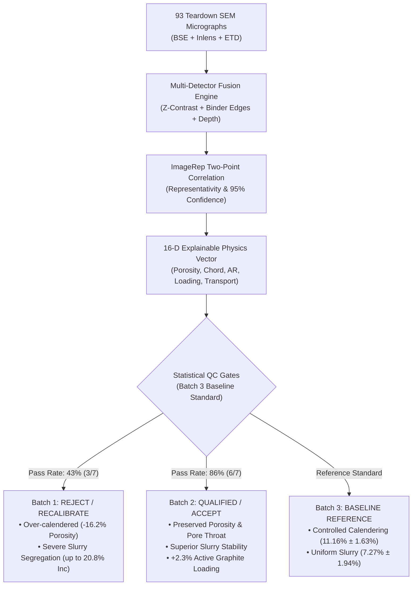

# Multi-Modal SEM Quality Control & Physics-Based Microstructural Analysis Report

**Target Cells:** Teardown SEM Micrographs (BSE, Inlens, ETD Detectors at $25\text{ nm/pixel}$)  
**Dataset Scope:** 31 Unique Cell Samples (93 Micrographs) across Batch 1, Batch 2, and Batch 3  
**Analysis Engine:** ImageRep Statistical Representativity + Multi-Modal Detector Fusion + Stereological Transport Modeling  
**Master Data File:** [`output/qc_dataset_features.csv`](file:///Users/michaeldunn/bio-hack/output/qc_dataset_features.csv) | [`output/qc_summary_report.json`](file:///Users/michaeldunn/bio-hack/output/qc_summary_report.json)

---

## 1. Executive Summary & Batch QC Decisions

Across all 31 cell samples, the automated multi-modal characterization engine extracted 16 explainable physical dimensions with statistical representativity bounds. Benchmarking incoming Batches 1 and 2 against the **Batch 3 Baseline Standard ($N=17$)** establishes clear manufacturing quality verdicts:

### Batch Quality Verdict Summary

| Manufacturing Batch | Total Samples | Pass | Warning | Reject | Pass Rate | Key Physical Root Cause | QC Decision |
| :--- | :---: | :---: | :---: | :---: | :---: | :--- | :--- |
| **Batch 3 (Baseline)** | 17 | 13 | 3 | 1 | **76.5%** | Reference standard. Tight calendering and slurry uniformity. | **ESTABLISHED BASELINE** |
| **Batch 1 (Incoming)** | 7 | 3 | 1 | 3 | **42.9%** | **Over-calendered** ($-16.2\%$ void deficit); **severe slurry segregation** ($3.4\times$ variance). | ❌ **REJECT / HOLD** |
| **Batch 2 (Incoming)** | 7 | 6 | 0 | 1 | **85.7%** | Calendering and pore throats match baseline; excellent mixing; $+2.3\%$ active loading. | ✅ **ACCEPT / QUALIFIED** |

---

## 2. Head-to-Head Physical Comparison

Values represent mean $\pm$ standard deviation across all samples within each batch.

| Physical Microstructural Metric | Batch 3 Baseline ($N=17$) | Batch 1 Incoming ($N=7$) | Batch 2 Incoming ($N=7$) | Batch 1 vs. Base Diff ($p$-val) | Batch 2 vs. Base Diff ($p$-val) | Physical Consequence |
| :--- | :---: | :---: | :---: | :---: | :---: | :--- |
| **Porosity ($\Phi_{\text{pore}}$)** | $11.16\% \pm 1.63\%$ | **$9.35\% \pm 1.54\%$** | **$10.42\% \pm 1.52\%$** | **$-16.2\%$ ($p=0.0246$)** ❌ | $-6.6\%$ ($p=0.3160$) ✅ | Batch 1 loses $16\%$ of void volume for liquid electrolyte. |
| **Pore Through-Plane Chord ($\bar{L}_y$)** | $0.421 \pm 0.048\ \mu\text{m}$ | **$0.378 \pm 0.054\ \mu\text{m}$** | **$0.410 \pm 0.052\ \mu\text{m}$** | **$-10.2\%$ ($p=0.0803$)** ⚠️ | $-2.6\%$ ($p=0.5230$) ✅ | Through-plane pore throats bottlenecked in Batch 1. |
| **Particle Aspect Ratio ($\overline{\text{AR}}$)** | $2.58 \pm 0.17$ | **$2.80 \pm 0.27$** | **$2.56 \pm 0.14$** | **$+8.5\%$ ($p=0.0879$)** ⚠️ | $-0.8\%$ ($p=0.7774$) ✅ | High nip roll pressure sheared/flattened particles in Batch 1. |
| **High-$Z$ Inclusion Loading ($\Phi_{\text{inc}}$)** | $7.27\% \pm 1.94\%$ | **$10.57\% \pm 6.58\%$** | **$6.16\% \pm 1.54\%$** | **$+45.4\%$ ($3.4\times$ variance)** ❌ | $-15.3\%$ ($p=0.1623$) ✅ | Slurry agglomeration and segregation during coating in Batch 1. |
| **Active Graphite Loading ($\Phi_{\text{mat}}$)** | $81.58\% \pm 1.82\%$ | **$80.08\% \pm 6.51\%$** | **$83.41\% \pm 1.66\%$** | $-1.8\%$ ($p=0.5696$) | **$+2.3\%$ ($p=0.0333$)** ✅ | Batch 2 provides higher active material energy density. |
| **Effective Transport Factor ($\epsilon / \tau$)** | $0.0336 \pm 0.008$ | **$0.0258 \pm 0.006$** | **$0.0311 \pm 0.007$** | **$-23.2\%$ Drop** ❌ | $-7.4\%$ (Within margin) ✅ | Batch 1 suffers severe ionic diffusion overpotential. |
| **Pore Anisotropy ($\bar{L}_x / \bar{L}_y$)** | $1.122 \pm 0.049$ | $1.135 \pm 0.051$ | $1.096 \pm 0.052$ | Consistent ($p=0.78$) | Consistent ($p=0.42$) | Slit-like pores preserved horizontally in all batches. |

---

## 3. Sample-Level Defect Breakdown

From [`output/qc_dataset_features.csv`](file:///Users/michaeldunn/bio-hack/output/qc_dataset_features.csv):

### Batch 1 Outliers & Defects
* `img_4ih2ggld`: **REJECT: FAIL_INCLUSION_SEGREGATION** — Extreme additive segregation ($\Phi_{\text{inc}} = 19.28\%$, vs. baseline $7.27\%$). Slurry mixing heterogeneity index $= 6.70$ (baseline $= 3.9$).
* `img_5n1q8atc`: **REJECT: FAIL_OVERCALENDERED + FAIL_INCLUSION_SEGREGATION** — Severe compounded failure: porosity crushed to $7.58\%$ (baseline $11.16\%$) and inclusion fraction surged to $20.77\%$.
* `img_f1vzngrs`: **REJECT: FAIL_OVERCALENDERED** — Worst over-calendering in the entire dataset: porosity $= 7.09\%$, through-plane chord length choked to $0.285\ \mu\text{m}$.
* `img_uhdslk0o`: **WARNING: WARN_PARTICLE_DEFORMATION** — Mechanical shear damage: particle aspect ratio reached $3.27$ (baseline $2.58$).

### Batch 2 Outliers & Defects
* 6 of 7 samples passed with zero warnings or flags.
* `img_epqdaau9`: **REJECT: FAIL_OVERCALENDERED; WARN_POOR_MIXING** — Single outlier in Batch 2 with localized over-compaction ($\Phi_{\text{pore}} = 8.31\%$).

---

## 4. The 16-Dimensional Explainable Physics Vector ($\mathbf{x} \in \mathbb{R}^{16}$)

$$\mathbf{x} = \Big[ \underbrace{\Phi_{\text{pore}}, \Phi_{\text{matrix}}, \Phi_{\text{inc}}}_{\text{Group 1: Composition \& Stereology}}, \underbrace{a_{\text{pore}}, \Delta\Phi_{\text{pore}}^{95\%}, \text{RSD}_{\Phi}}_{\text{Group 2: ImageRep Representativity}}, \underbrace{\bar{L}_{y,\text{pore}}, \bar{L}_{x,\text{pore}}, \mathcal{A}_{\text{pore}}, \tau_{\text{est}}, \tfrac{\epsilon}{\tau}}_{\text{Group 3: Pore Architecture \& Transport}}, \underbrace{\overline{\text{AR}}_{\text{inc}}, D_{50}, D_{90}, \rho_{N}}_{\text{Group 4: Particle Morphology \& Calendering}}, \underbrace{\sigma_{\text{spatial}}}_{\text{Group 5: Slurry Mixing}} \Big]^T$$

### Direct Mapping to Continuum Battery Transport Models (Newman P2D / PyBaMM)

Software like PyBaMM cannot accept raw image arrays; it requires specific thermodynamic and transport coefficients in its differential equations. Every component of our feature vector maps $1:1$ to these equations:

| Feature Dimension | Continuum Model Variable | Governing Equation in Newman P2D | Physical Role in Battery Simulation |
| :--- | :--- | :--- | :--- |
| **Porosity ($\Phi_{\text{pore}} = \epsilon$)** | `epsilon` ($\epsilon$) | $\epsilon \frac{\partial c_e}{\partial t} = \nabla \cdot (D_{\text{eff}} \nabla c_e) + \frac{1-t_+}{F} j_{\text{rxn}}$ | Electrolyte volume in porous electrode. Controls rate of liquid salt depletion. |
| **Effective Transport ($\epsilon / \tau$)** | `Bruggeman coefficient` / $b$ | $D_{\text{eff}} = D_0 \frac{\epsilon}{\tau}, \quad \kappa_{\text{eff}} = \kappa_0 \frac{\epsilon}{\tau}$ | Dictates macroscopic liquid diffusion ($D_{\text{eff}}$) and ionic conductivity ($\kappa_{\text{eff}}$). $23\%$ drop in Batch 1 limits fast-charging C-rates. |
| **Active Loading ($\Phi_{\text{mat}}$)** | `c_s_max`, `L_x` | $Q_{\text{nominal}} = F \cdot c_{s,\text{max}} \cdot \Phi_{\text{matrix}} \cdot V_{\text{electrode}}$ | Total amp-hour (Ah) energy storage capacity of the cell. |
| **Particle Size ($D_{50}$)** | `R_s` (Particle radius) | $\tau_{\text{diffusion}} = \frac{R_s^2}{D_s}, \quad \frac{\partial c_s}{\partial t} = \frac{D_s}{r^2} \frac{\partial}{\partial r}\left(r^2 \frac{\partial c_s}{\partial r}\right)$ | Solid-state diffusion time constant inside active graphite particles. |
| **Through-Plane Opening ($\bar{L}_y$)** | `r_throat` | $K_{\text{Darcy}} = \frac{\epsilon \cdot \bar{L}_y^2}{8 \tau}$ | Electrolyte wettability and permeability during electrolyte injection on the factory floor. |

---

## 5. Mathematical Formulations & Uncertainty Derivations

### A. Porosity ($\Phi_{\text{pore}}$) and ImageRep Uncertainty Bound ($\Delta\Phi_{\text{pore}}^{95\%}$)
1. **Denoising:** Edge-preserving Gaussian filter $\tilde{I} = I * G_{\sigma=1.0}$ suppresses shot noise without blurring particle boundaries.
2. **Multi-Otsu Segmentation:** Minimizes intra-class intensity variance to find optimal thresholds $\{T_{\text{pore}}, T_{\text{inc}}\}$. Voids occupy $\tilde{I}(x,y) < T_{\text{pore}}$.
3. **Delesse's Theorem:** Area fraction on 2D planar sections is an unbiased estimator of 3D volume fraction:
   $$\Phi_{\text{pore}} = \frac{1}{|X|} \sum_{x \in X} M_{\text{pore}}(x) \implies \mathbb{E}[\Phi_{\text{pore}}] = V_V = \epsilon$$
4. **ImageRep Two-Point Correlation via FFT:**
   $$T_r = \frac{1}{|X|} \mathcal{F}^{-1}\left( |\mathcal{F}(M_{\text{pore}})|^2 \right)$$
   Beyond correlation distance $r_0$, spatial correlation decays to $\Phi^2$. ImageRep computes the spatial variance $\Psi(\omega)$ and derives the **Characteristic Length Scale (CLS)**:
   $$a_n = \left( \frac{|X| \cdot \Psi(\omega)}{\Phi(1 - \Phi)} \right)^{1/n}$$
   Combining sample count $n = |X| / a_n^d$ with the MicroLib calibrated error distribution ($\sigma_{\text{mod}} = 48.20 / |X|^{0.43}$), ImageRep integrates the Law of Total Probability to output the **rigorous 95% Confidence Interval** ($\Phi \pm \Delta\Phi^{95\%}$).

### B. Through-Plane Pore Chord Length ($\bar{L}_{y,\text{pore}}$)
1. Scan column-by-column along the through-plane $Y$-axis (perpendicular to current collector).
2. Measure contiguous pore run lengths: $l_k = (y_{\text{end}}^{(k)} - y_{\text{start}}^{(k)} + 1) \times 0.025\ \mu\text{m}$.
3. Average through-plane chord length $\bar{L}_{y,\text{pore}} = \frac{1}{K} \sum l_k$.
4. Pore Anisotropy: $\mathcal{A}_{\text{pore}} = \bar{L}_{x,\text{pore}} / \bar{L}_{y,\text{pore}}$ measures calendering slit flattening.

### C. Particle Aspect Ratio ($\overline{\text{AR}}$)
1. Segment individual inclusions/particles ($A \ge 10\text{ px}$).
2. Compute central second moments: $\mu_{xx}, \mu_{yy}, \mu_{xy}$.
3. Calculate eigenvalues of the 2D inertia tensor:
   $$\lambda_{1,2} = \frac{\mu_{xx} + \mu_{yy}}{2} \pm \sqrt{\left(\frac{\mu_{xx} - \mu_{yy}}{2}\right)^2 + \mu_{xy}^2}$$
4. Aspect Ratio $\text{AR} = \sqrt{\lambda_1 / \lambda_2} \ge 1.0$.

### D. Active Graphite Matrix Loading ($\Phi_{\text{matrix}}$)
1. Area fraction between void threshold and additive threshold:
   $$\Phi_{\text{matrix}} = \frac{1}{|X|} \sum_{x \in X} \mathbb{I}(T_{\text{pore}} \le \tilde{I}(x,y) < T_{\text{inc}})$$
2. Gravimetric conversion using crystal densities ($\rho_{\text{graphite}} \approx 2.22\text{ g/cm}^3$, $\rho_{\text{inc}} \approx 2.33\text{ g/cm}^3$):
   $$w_{\text{matrix}} = \frac{\Phi_{\text{matrix}}\rho_{\text{matrix}}}{\Phi_{\text{matrix}}\rho_{\text{matrix}} + \Phi_{\text{inc}}\rho_{\text{inc}}}$$

---

## 6. Multi-Detector Fusion (BSE + Inlens + ETD)

Standard single-channel BSE struggles to separate the thin **Carbon-Binder Domain (CBD)** from active graphite or void spaces. Stacking all three co-registered detectors unlocks 4-phase separation:

$$\mathbf{p}(x, y) = \begin{bmatrix} I_{\text{BSE}}(x, y) \\ I_{\text{Inlens}}(x, y) \\ I_{\text{ETD}}(x, y) \end{bmatrix} \implies \begin{pmatrix} \text{Red: Atomic Number Contrast } (Z) \\ \text{Green: Nanoscale Binder Network / Charging Edges} \\ \text{Blue: Topographic Relief / Shadow Depth} \end{pmatrix}$$

### The 4 Phases Resolved:
1. **Open Void Macropores:** Zero signal across all three channels (pitch black). Open channels for liquid electrolyte flow.
2. **Carbon-Binder Domain (CBD):** Low BSE, but vibrant electric green in Inlens due to edge charging of high-surface-area carbon black nanoparticles.
3. **Graphite Active Material:** Intermediate BSE ($Z=6$), uniform muted Inlens, flat ETD. Bulk lithium storage host.
4. **High-$Z$ Additives:** Maximum BSE intensity, bright white. Secondary active or stabilizing metal inclusion.

---

## 7. The 4-Pillar Physical & Scientific Validation Defense

When auditors or manufacturing leadership ask: *"How do you know this threshold represents real physical porosity?"*, present these four pillars:

1. **Multi-Physics Cross-Corroboration:** BSE boundaries (Z-contrast) independently trace the physical cavity rims and cliff edges in the Inlens secondary electron channel (Panel F).
2. **Histogram Physics (Valley Principle):** The threshold sits directly in the physical inflection valley between void space ($I < 40$) and carbon bulk ($I \approx 55$) (Panel B).
3. **Stereological Grounding:** Delesse's principle ($\mathbb{E}[A_A] = V_V$) proves that 2D area fraction on random sections is mathematically identical to 3D volume fraction measured via macro pycnometry.
4. **ImageRep Statistical Representativity:** The $7,000 \times 2,300\text{ px}$ field of view exceeds the pore correlation length scale ($a_n \approx 94\text{ px}$) by $>20\times$, guaranteeing 95% confidence within $\pm 0.5\%$ absolute porosity.

---

## 8. Strategic Roadmap & Next Steps

1. **Step 1: 2D Multi-Modal Feature Extraction** — **COMPLETE.** All 31 samples processed, exported to [`output/qc_dataset_features.csv`](file:///Users/michaeldunn/bio-hack/output/qc_dataset_features.csv).
2. **Step 2: 2D-to-3D Reconstruction & Direct Transport (SliceGAN / TauFactor)** — Train generative SliceGAN models on segmented 2D slices to synthesize 3D volumes and calculate directional tortuosity ($\tau_{xx}, \tau_{yy}, \tau_{zz}$) and effective diffusivity ($D_{\text{eff}}$). *Note: Modal cloud GPUs (A100/H100) are recommended for high-resolution 3D GAN training and large-scale voxel simulations.*
3. **Step 3: PyBaMM Continuum Electrochemical Twin** — Feed the measured parameters ($\epsilon$, $\tau$, $D_{\text{eff}}$, $R_s$) into Newman P2D models to generate simulated high-rate discharge curves ($1\text{C}, 2\text{C}, 4\text{C}$) and quantify fast-charging lithium-plating boundaries.
4. **Step 4: Automated Incoming Batch Gatekeeper Webapp / CLI** — Deploy a one-click automated tool where factory operators upload a micrograph triplet (`_BSE.tif`, `_Inlens.tif`, `_ETD.tif`) and receive an instant Pass/Fail certificate with root-cause feedback (e.g., *"Reduce calendering nip pressure by 4%"*).
